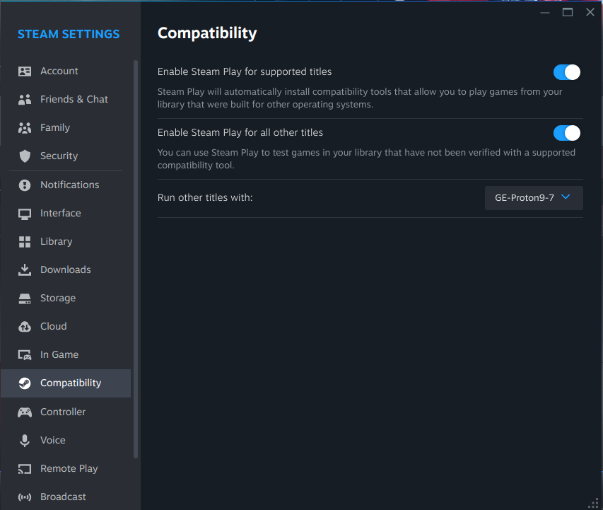
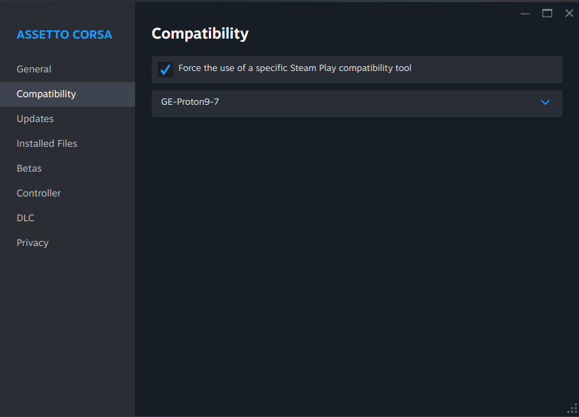
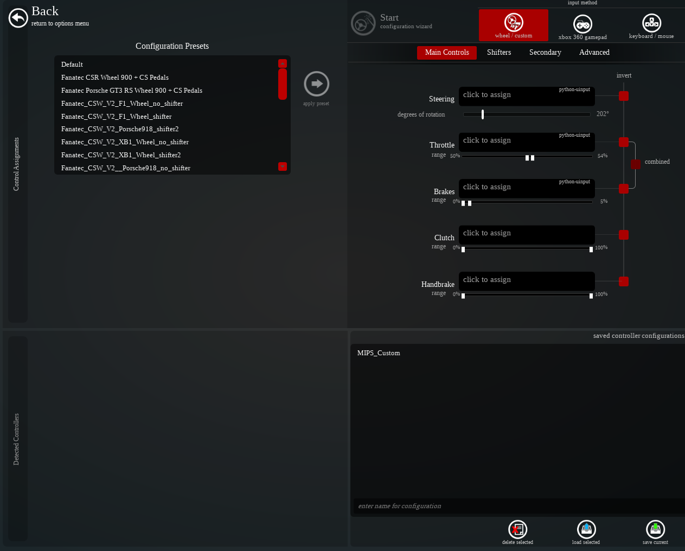
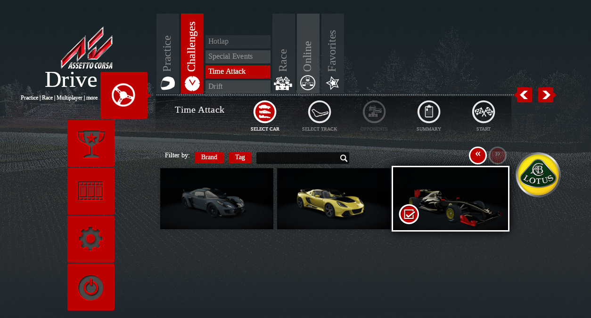
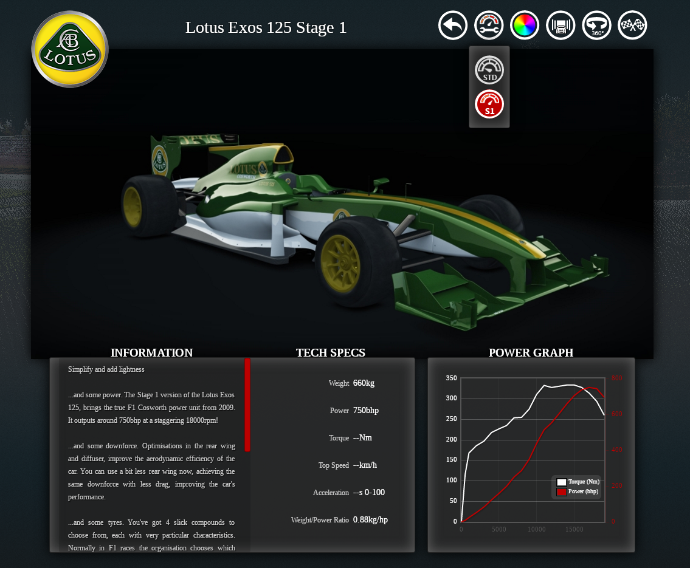

# MIPS Asseto Corsa controller & dashboard

## Game install

In order for this project to work, you need to install Asseto Corsa on steam. This needs to have a compatibility layer added BEFORE THE GAME because this is a Windows native game.

### Proton GE compatibility install 

Here is the link to the github page : https://github.com/GloriousEggroll/proton-ge-custom

You can follow the manual installation instructions by just copy-pasting the "Terminal example based on Latest Release".

### Configure steam

In order to allow non-Windows game to use proton GE, you must enable compatibility in the steam setting and set them as : 

You can select proton GE here or set it to run only Asseto Corsa : (Right click on the game in the steam library -> properties)

### Configure the game's controls 

In order for the game to recognize the controls sent by our Mylabs, we need to copy the `controller_config/MIPS_Custom.ini` file from this git into this folder (example from my computer) : `/home/joachim/.steam/debian-installation/steamapps/compatdata/244210/pfx/drive_c/users/steamuser/Documents/Assetto Corsa/cfg/controllers/savedsetups`

In the game's settings (after a relaunch of the game), you can now load the MIPS_Custom controller preset : 

## Launch the telemetry tool

To display the telemetry onto the dashboard and to be able to send inputs from it, you must run the following python3 script : `scripts/asseto.py`.

## Play the game

### Choose the right car

This tool has been developed for only one car : Lotus Exos 125 Stage 1.

In the menu, before launching the game, select the Lotus Exos 125 : 

Then mouse over it and click on the wrench in the bottom right, then click on it and choose the S1 variant : 

